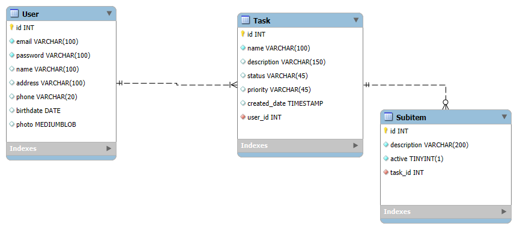

# 🎨 **Fast Task - Sua Plataforma de Produtividade** 🚀

Bem-vindo(a) ao projeto Fast Task, sua solução completa para gerenciamento de tarefas! 🎉 Nosso ecossistema de produtividade é construído com tecnologias de ponta, oferecendo uma experiência fluida tanto para o usuário quanto para o desenvolvedor. Prepare-se para uma imersão no nosso universo de organização e eficiência! 🤓

---

## 🌟 **Visão Geral**

O Fast Task é um **sistema de gerenciamento de tarefas** composto por três pilares principais:

- **Backend:** A espinha dorsal da aplicação, responsável por toda a lógica de negócio, persistência de dados e autenticação. Desenvolvido em Java com Spring Boot. ☕
- **Frontend:** A interface do usuário onde toda a interação acontece. Construído com React, Redux e JWT para uma experiência dinâmica e segura. ✨
- **Landing Page:** A porta de entrada para novos usuários, apresentando de forma clara e impactante as funcionalidades do Fast Task. Desenvolvida com React, TypeScript e Vite.  💨
Todo o projeto reside no repositório ```git@github.com:JordanFlp/fasttask.git```, com cada componente em seu diretório específico.

---

## 🛠️ **Tecnologias Utilizadas**

Para construir essa plataforma robusta, utilizamos um arsenal de ferramentas de ponta em cada um dos nossos módulos:

##### ⚙️ **Backend**
- Linguagem: Java 21 ☕
- Gerenciador de Dependências: Maven 📦
- Framework: Spring Boot 🌱
- Banco de Dados: MySQL 🐬
- ORM: JPA / Hibernate 🔁
- Criptografia: jBCrypt (para criptografia de senhas) 🔒
- Serialização de Datas: Jackson Datatype JSR310 (para suporte a tipos de data e hora do Java 8+) 🗓️

##### 🌐 **Frontend**
- Framework Frontend: React ⚛️
- Gerenciamento de Estado: Redux (para controle de estado global e fluxo de dados) 🔄
- Autenticação: JWT (JSON Web Tokens para autenticação de usuário) 🔐
- Linguagem: JavaScript (.js) ✍️
- Gerenciador de Pacotes: npm 📦

##### 🎨 **Landing Page**
- Framework Frontend: React ⚛️ (para criar interfaces incríveis!)
- Linguagem: TypeScript ✍️ (para um código mais seguro e sem surpresas!)
- Ferramenta de Build: Vite ⚡ (velocidade turbo para desenvolvimento e build!)
- Gerenciador de Pacotes: Yarn 🧶 (para manter todas as dependências organizadas!)
- Linting: ESLint 👮‍♀️ (para garantir que nosso código esteja sempre impecável!)

---

## 🚀 **Como Iniciar (Aventura do Desenvolvedor)**
Quer ver a Landing Page em ação ou contribuir? **Siga estes passos mágicos:**

##### 1. Clone o repositório do nosso projeto:
```bash
git clone git@github.com:JordanFlp/fasttask.git
```

##### 2. **Configure e Execute o Backend**

###### Teletransporte-se para o diretório da Landing Page:
```bash
cd fasttask/fasttask
```
###### Crie o banco de dados MySQL com o seguinte script 🗄️:
```bash
-- -----------------------------------------------------
-- Schema fastTask
-- -----------------------------------------------------

SET @OLD_UNIQUE_CHECKS=@@UNIQUE_CHECKS, UNIQUE_CHECKS=0;
SET @OLD_FOREIGN_KEY_CHECKS=@@FOREIGN_KEY_CHECKS, FOREIGN_KEY_CHECKS=0;
SET @OLD_SQL_MODE=@@SQL_MODE, SQL_MODE='ONLY_FULL_GROUP_BY,STRICT_TRANS_TABLES,NO_ZERO_IN_DATE,NO_ZERO_DATE,ERROR_FOR_DIVISION_BY_ZERO,NO_ENGINE_SUBSTITUTION';

CREATE SCHEMA IF NOT EXISTS `fastTask` DEFAULT CHARACTER SET utf8 ;
USE `fastTask` ;

-- -----------------------------------------------------
-- Table `fastTask`.`User`
-- -----------------------------------------------------
CREATE TABLE IF NOT EXISTS `fastTask`.`User` (
  `id` INT NOT NULL AUTO_INCREMENT,
  `email` VARCHAR(100) NOT NULL,
  `password` VARCHAR(100) NOT NULL,
  `name` VARCHAR(100) NULL,
  `address` VARCHAR(100) NULL,
  `phone` VARCHAR(20) NULL,
  `birthdate` DATE NULL,
  `photo` MEDIUMBLOB NULL,
  PRIMARY KEY (`id`),
  UNIQUE INDEX `email_UNIQUE` (`email` ASC) VISIBLE)
ENGINE = InnoDB;


-- -----------------------------------------------------
-- Table `fastTask`.`Task`
-- -----------------------------------------------------
CREATE TABLE IF NOT EXISTS `fastTask`.`Task` (
  `id` INT NOT NULL AUTO_INCREMENT,
  `name` VARCHAR(100) NOT NULL,
  `description` VARCHAR(150) NULL,
  `status` VARCHAR(45) NULL,
  `priority` VARCHAR(45) NULL,
  `created_date` TIMESTAMP NULL DEFAULT CURRENT_TIMESTAMP ON UPDATE CURRENT_TIMESTAMP,
  `user_id` INT NOT NULL,
  PRIMARY KEY (`id`),
  INDEX `fk_Tasks_Users_idx` (`user_id` ASC) VISIBLE,
  CONSTRAINT `fk_Tasks_Users`
    FOREIGN KEY (`user_id`)
    REFERENCES `fastTask`.`User` (`id`)
    ON DELETE NO ACTION
    ON UPDATE NO ACTION)
ENGINE = InnoDB;


-- -----------------------------------------------------
-- Table `fastTask`.`Subitem`
-- -----------------------------------------------------
CREATE TABLE IF NOT EXISTS `fastTask`.`Subitem` (
  `id` INT NOT NULL AUTO_INCREMENT,
  `description` VARCHAR(200) NOT NULL,
  `active` TINYINT(1) NOT NULL,
  `task_id` INT NOT NULL,
  PRIMARY KEY (`id`),
  INDEX `fk_Subitems_Tasks1_idx` (`task_id` ASC) VISIBLE,
  CONSTRAINT `fk_Subitems_Tasks1`
    FOREIGN KEY (`task_id`)
    REFERENCES `fastTask`.`Task` (`id`)
    ON DELETE NO ACTION
    ON UPDATE NO ACTION)
ENGINE = InnoDB;


SET SQL_MODE=@OLD_SQL_MODE;
SET FOREIGN_KEY_CHECKS=@OLD_FOREIGN_KEY_CHECKS;
SET UNIQUE_CHECKS=@OLD_UNIQUE_CHECKS;

```

###### 🖼️ Diagrama do Banco de Dados



###### Configure o application.properties com as credenciais do seu banco:

Certifique-se de que o nome do banco de dados (fasttask) corresponde ao definido no script SQL.

Exemplo:
```bash
spring.datasource.url = jdbc:mysql://localhost:3306/fasttask?useTimezone=true&serverTimezone=UTC
spring.datasource.username = seu-usuario
spring.datasource.password = sua-senha
```

###### Execute o projeto

```bash
mvn spring-boot:run
```
O backend estará acessível geralmente em ```http://localhost:8080```.

##### 3. **Configure e Execute o Frontend**
###### Teletransporte-se para o diretório do Frontend:
```bash
cd fasttask/front/fasttask-frontend
```

###### Instale as poções (dependências):
```bash
npm install
```

###### Ligue o motor (servidor de desenvolvimento):
```bash
npm start
```

Isso vai iniciar o servidor de desenvolvimento e você poderá ver a aplicação frontend ganhando vida, geralmente em ```http://localhost:3000```. 🥳

##### 4. **Configure e Execute a Landing Page**
###### Teletransporte-se para o diretório da Landing Page:
```bash
cd fasttask/lp_fast_task
```

###### Instale as poções (dependências):
```bash
yarn install
```

###### Ligue o motor (servidor de desenvolvimento):
```bash
yarn dev
```
Isso vai iniciar o servidor de desenvolvimento e você poderá ver a Landing Page ganhando vida, geralmente em ```http://localhost:5173```. 🥳

---

## 📂 **Estrutura de Pastas**
A organização é a chave para a produtividade! Aqui está como estruturamos nosso código para facilitar a vida de todos em cada um dos nossos módulos:

##### ⚙️ Estrutura do Projeto Backend
```bash
br.com.fasttask.fasttask  → Pacote principal da aplicação
├── config                → Configurações (CoreConfig.java, SecurityConfig.java)
├── controller            → Camada de controle/APIs (SubitemController.java, TaskController.java, UserController.java)
├── dto                   → Objetos de Transferência de Dados (CreateUserDTO.java, UpdateUserDTO.java, UserLoginDTO.java, UserResponseDTO.java)
├── exception             → Classes de exceção personalizadas (EmailAlreadyExistsException.java, InvalidRequestException.java, TaskNotFoundException.java, UserNotFoundException.java)
├── model                 → Modelos de dados/entidades (Subitem.java, Task.java, User.java)
├── repository            → Interfaces de repositório para acesso a dados (ISubitemRepository.java, ITaskRepository.java, IUserRepository.java, SubitemRepositoryImpl.java, TaskRepositoryImpl.java, UserRepositoryImpl.java)
├── service               → Camada de serviço/regras de negócio (ISubitemService.java, ITaskService.java, IUserService.java, SubitemServiceImpl.java, TaskServiceImpl.java, UserServiceImpl.java)
└── util                  → Utilitários (BCryptPasswordGenerator.java, FasttaskApplication.java)
```

##### 🌐 Estrutura do Projeto Frontend
```bash
front/fasttask-frontend/
├── node_modules/           # 📦 Onde todas as dependências do projeto moram
├── public/                 # 🌐 Arquivos públicos (ex: index.html, logo.svg)
├── src/                    # 💖 O coração da nossa aplicação: todo o código fonte
│   ├── components/         # 🧩 Componentes React reutilizáveis (SubitemForm, SubitemList, TaskForm, TaskList)
│   ├── pages/              # 📄 Páginas da aplicação (DashboardPage, LoginPage, ProfilePage, RegisterPage, TaskDetailPage)
│   ├── services/           # 🤝 Módulos para comunicação com o backend (SubitemService, TaskService, UserService)
│   ├── styles/             # 🎨 Arquivos de estilo CSS por componente/página
│   ├── App.css             # 🎨 Estilos que abraçam toda a aplicação
│   ├── App.js              # 🌟 O componente principal que orquestra tudo
│   ├── App.test.js         # 🧪 Testes para o componente principal
│   ├── index.css           # 📝 Estilos base que definem o tom
│   ├── index.js            # 🚪 A porta de entrada para a nossa aplicação React
│   ├── logo.svg            # 🖼️ Logo da aplicação
│   ├── reportWebVital.js   # 📊 Relatório de web vitals
│   └── setupTests.js       # 🧪 Configuração de testes
├── .gitignore              # 👻 O que o Git deve ignorar
├── package-lock.json       # 🔒 Versões exatas das dependências (do npm)
└── package.json            # 📄 Informações do projeto e todas as suas dependências
```

##### 🎨 Estrutura do Projeto Landing Page
```bash
lp_fast_task/
├── node_modules/           # 📦 Onde todas as dependências do projeto moram (não toque aqui! 😉)
├── src/                    # 💖 O coração da nossa aplicação: todo o código fonte
│   ├── assets/             # 🖼️ Imagens, ícones, fontes... tudo que dá vida ao design!
│   ├── components/         # 🧩 Componentes React que podem ser reutilizados em qualquer lugar
│   ├── routes/             # 🗺️ Se tivermos rotas internas, elas ficam aqui!
│   ├── sections/           # 🧱 Blocos gigantes da nossa página, cada um com sua função
│   │   ├── BenefitsSection/     # ✅ Mostrando por que você vai amar o Fast Task!
│   │   ├── CallToActionSection/ # 📞 Chamando a galera para a ação!
│   │   ├── FeaturesSection/     # ✨ Destacando as funcionalidades mais legais!
│   │   ├── HeroSection/         # 🦸 A primeira impressão é a que fica! O topo da página!
│   │   │   ├── index.tsx     # 🧠 O cérebro da nossa seção Hero
│   │   │   └── style.css     # 💅 A maquiagem da nossa seção Hero
│   │   ├── HowItWorksSection/   # ⚙️ Explicando como tudo funciona, passo a passo
│   │   └── PricingSection/      # 💰 Mostrando nossos planos incríveis!
│   ├── App.css             # 🎨 Estilos que abraçam toda a aplicação
│   ├── App.tsx             # 🌟 O componente principal que orquestra tudo
│   ├── index.css           # 📝 Estilos base que definem o tom
│   ├── index.tsx           # 🚪 A porta de entrada para a nossa aplicação React
│   ├── main.tsx            # 🚀 Onde o React ganha vida no DOM
│   ├── theme.ts            # 🌈 Definições de cores, fontes... nossa identidade visual!
│   ├── types.ts            # 🏷️ Declarações de tipos para um TypeScript feliz
│   └── vite-env.d.ts       # 🛠️ Arquivos de ambiente do Vite
├── .gitignore              # 👻 O que o Git deve ignorar (coisas temporárias e segredos!)
├── eslint.config.js        # 📜 As regras de ouro do nosso código (ESLint)
├── index.html              # 🌐 O esqueleto da nossa página web
├── package-lock.json       # 🔒 Versões exatas das dependências (do npm, mas yarn.lock é o rei aqui!)
├── package.json            # 📄 Informações do projeto e todas as suas dependências
├── README.md               # 📖 Você está lendo ele agora! 😉
├── tsconfig.app.json       # ⚙️ Configurações TypeScript para a nossa aplicação
├── tsconfig.json           # ⚙️ Configurações TypeScript globais
├── tsconfig.node.json      # ⚙️ Configurações TypeScript para o ambiente Node.js (Vite, ESLint)
├── vite.config.ts          # ⚙️ As configurações do nosso construtor rápido (Vite)
└── yarn.lock               # 🔒 Versões exatas das dependências (do Yarn)
```
---

## 🧩 **Funcionalidades Principais**

### Backend

- #### Gerenciamento de Usuários: 👤
    - Criação de novos usuários.
    - Busca de usuários por ID.
    - Atualização de dados de usuários.
    - Exclusão de usuários.
- #### Gerenciamento de Tarefas: 📋
    - Criação de novas tarefas.
    - Busca de tarefas por ID.
    - Atualização de tarefas.
    - Exclusão de tarefas.
- #### Gerenciamento de Subitens de Tarefas: ✅
    - Criação de novos subitens para tarefas.
    - Busca de subitens por ID.
    - Atualização de subitens.
    - Exclusão de subitens.
    - Autenticação de Usuários: 🔐
    - Login seguro com email e senha.

### Frontend
- Autenticação de Usuários: Interface para registro e login.
- Dashboard de Tarefas: Visão geral das tarefas do usuário.
- Gerenciamento de Tarefas: Criação, edição, visualização e exclusão de tarefas.
- Gerenciamento de Subitens: Adição, edição e marcação de subitens em tarefas.
- Perfil do Usuário: Visualização e atualização de informações do perfil.

### Landing Page
- ***Seção Hero:*** A primeira impressão impactante do Fast Task.
- ***Seção de Benefícios:*** Destaca as vantagens de usar a plataforma.
- ***Seção de Funcionalidades:*** Apresenta as principais características do Fast Task.
- ***Seção "Como Funciona":*** Explica o processo de uso da plataforma.
- ***Seção de Preços:*** Detalha os planos disponíveis (se houver).
- ***Chamada para Ação (Call to Action):*** Incentiva o usuário a experimentar o Fast Task.

---

## 🔗 **Endpoints do Backend**
A API do Fast Task oferece os seguintes endpoints para gerenciamento de dados:

#### 👤 /user – Gerenciamento de usuários
-  ```POST /user``` – Criar novo usuário

Exemplos de payload:
```bash
{
  "email": "tetemaria@teste.com",
  "password": "123456",
  "name": "Maria Tereza"
}
```
```bash
curl --location 'http://localhost:8080/user' \
--header 'Content-Type: application/json' \
--data-raw '{
    "email": "emailTeste@teste.com",
    "password": "senha",
    "name": "User Name",
    "address": null,
    "phone": null,
    "birthdate": null,
    "photo": null,
    "tasks": null
}'
```

- ```GET /user/{id}``` – Buscar usuário por ID

- ```PUT /user/{id}``` – Atualizar usuário

Exemplo: 
```bash
curl --location --request PUT 'http://localhost:8080/user/7' \
--header 'Content-Type: application/json' \
--data-raw '{
    "id": 7,
    "email": "mariaTeste@teste.com",
    "password": "newPassword",
    "name": "Maria Tester da Silva",
    "address": "Rua dos Bobos, 00",
    "phone": "41 999999999",
    "birthdate": "1987-08-27",
    "photo": null,
    "tasks": []
}'
```

- ```DELETE /user/{id}``` – Deletar usuário

#### 🔐 /user/login – Autenticação
- ```POST /user/login``` – Login com email e senha

Exemplo:
```bash
curl --location 'http://localhost:8080/user/login' \
--header 'Content-Type: application/json' \
--data-raw '{
  "email": "email@teste.com",
  "password": "senha123"
}'
```


#### 📋 /task – Gerenciamento de tarefas
- ```POST /task``` – Criar nova tarefa

Exemplo:
```bash
{
  "name": "Tarefa de teste",
  "description": "Descrição da tarefa de teste",
  "status": "A fazer",
  "priority": "Alta",
  "created_date": "2023-03-01T12:00:00",
  "user": {
    "id": 1
  },
  "subitems": []
}
```

- ```GET /task/{id}``` – Buscar tarefa por ID

- ```PUT /task/{id}``` – Atualizar tarefa

Exemplo:
```bash
curl --location --request PUT 'http://localhost:8080/task/5' \
--header 'Content-Type: application/json' \
--data '{
  "id": 5,
  "name": "Tarefa de teste atualizada",
  "description": "Descrição da tarefa de teste atualizada",
  "status": "Em andamento",
  "priority": "Média",
  "created_date": "2023-03-01T12:00:00",
  "user": {
    "id": 1
  },
  "subitems": []
}'
```

- ```DELETE /task/{id}``` – Deletar tarefa


#### ✅ /subitem – Gerenciamento de subitens
- ```POST /subitem``` – Criar novo subitem

Exemplo:
```bash
curl --location 'http://localhost:8080/subitem' \
--header 'Content-Type: application/json' \
--data '{
    "description": "Subitem de teste",
    "active": true,
    "task": {
        "id": 4
    }
}'
```

- ```GET /subitem/{id}``` – Buscar subitem por ID

- ```PUT /subitem/{id}``` – Atualizar subitem

Exemplo:
```bash
curl --location --request PUT 'http://localhost:8080/subitem/3' \
--header 'Content-Type: application/json' \
--data '{
    "id": 3,
    "description": "Limpar móveis",
    "active": true,
    "task": {
        "id": 4
    }
}'
```

- ```DELETE /subitem/{id}``` – Deletar subitem

---

## 🌈 **Paleta de Cores (As Cores da Nossa Vibe)**
Cada cor tem um propósito! Nossa paleta foi cuidadosamente selecionada para uma experiência visual harmônica e convidativa na Landing Page. 🎨


| Elemento                 | Cor                  | Código Hex | Uso                                                       |
|:-------------------------|:---------------------|:-----------|:----------------------------------------------------------|
| **Primária** | Teal                 | `#2AB6A5`  | Botões principais, ícones ativos, destaques - o nosso toque especial! ✨ |
| **Secundária** | Navy (Azul Escuro)   | `#10375C`  | Cabeçalhos fortes, texto importante, rodapé - a base da nossa solidez! ⚓ |
| **Plano de Fundo Claro** | Cinza Gelo           | `#F4F7F8`  | Background padrão, seções alternadas - leveza e clareza! 🌬️ |
| **Texto Principal** | Cinza Grafite        | `#2C2C2C`  | O corpo do texto, legível e elegante! 🖋️                   |
| **Texto Suave** | Cinza Médio          | `#7A7A7A`  | Subtítulos, textos auxiliares - para um toque sutil! 🤏     |
| **Ação/Ênfase** | Azul Claro / Hover Teal | `#3ED0C0`  | Onde a magia acontece ao interagir: botões e links vibrantes! 💫 |
| **Alerta/Erro** | Vermelho Suave       | `#E74C3C`  | Mensagens de erro e campos inválidos - atenção redobrada! ⚠️ |
| **Sucesso** | Verde Claro          | `#2ECC71`  | Confirmações e status concluído - uhuul, deu tudo certo! ✅ |

---

## 🤝 **Colaboradores**

Este projeto é fruto do trabalho e dedicação dos seguintes colaboradores:

* [Ioly Oliveira](https://github.com/iolymmoliveira)
* [Jordan Felipe](https://github.com/jordanFlp)
* [Renato Tavares](https://github.com/renatoeTavares)

---

### 📄 Licença
Este projeto está licenciado sob a Licença MIT.

---